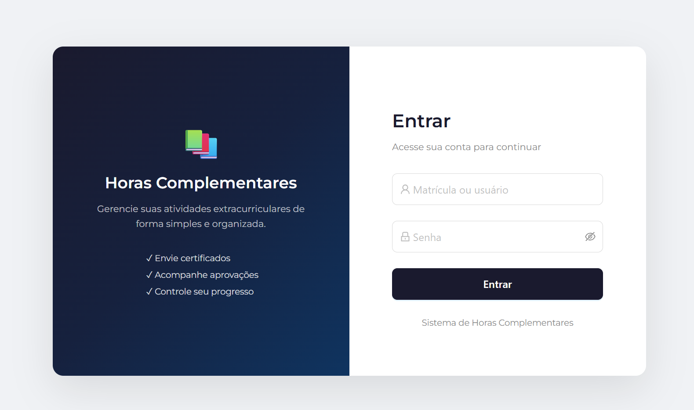
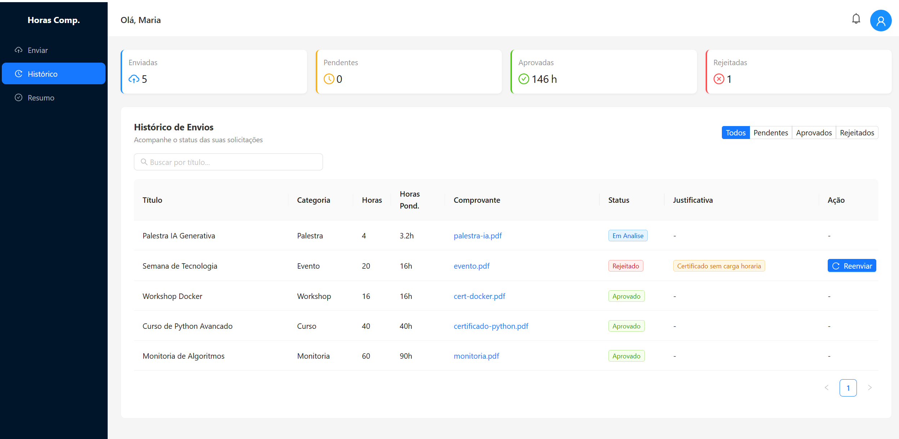
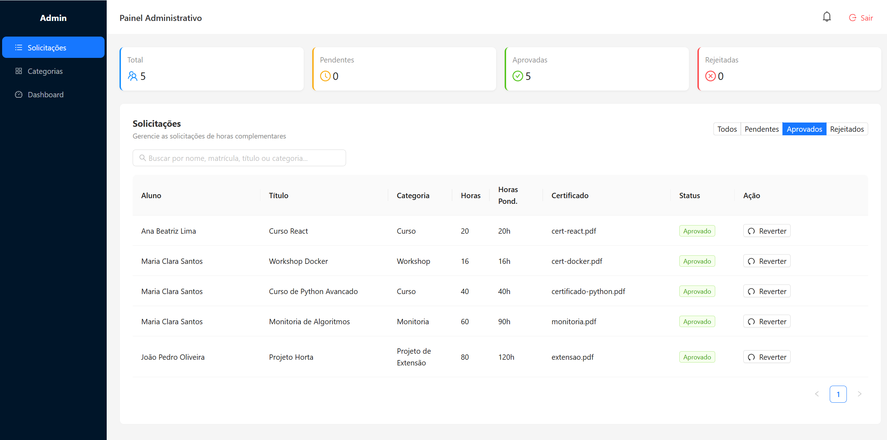

# 📚 Complementary Hours Management System

Full-stack system for managing academic extracurricular activities. Students submit certificates, directors approve/reject them, and the system automatically controls limits, weights, and progress tracking.

## � Screenshots

### Login


### Student Panel


### Admin Panel


## �🛠 Tech Stack

| Layer | Technology |
|-------|-----------|
| Backend | Python, Flask, SQLAlchemy, Marshmallow, JWT |
| Frontend | React, Ant Design |
| Database | MySQL 8.0 |
| Infrastructure | Docker, Docker Compose |

## ✨ Features

### Student
- Submit activities with mandatory proof of completion
- Categories with configurable limits and weights
- Resubmit rejected activities
- Progress tracking (approved hours vs goal)
- Real-time notifications (approval/rejection)
- Search and filter by title and status

### Director/Admin
- Approve/reject with reason
- Revert decisions
- Category management (CRUD with limits and weights)
- Dashboard with aggregated metrics
- Notifications on new submissions
- Search by name, student ID, title, and category
- Filter by status and class

### Technical
- JWT authentication with bcrypt (automatic plaintext migration)
- Soft delete with `deleted_at`
- Server-side pagination
- Marshmallow schema validation
- Global error handlers (always JSON responses)
- Structured logging
- Health check endpoint
- Role-based route protection (frontend)

## 🚀 Getting Started

### Prerequisites
- Docker and Docker Compose installed

### Setup

```bash
# Clone
git clone https://github.com/IsaacMartins12/Launcher.git
cd Launcher

# Configure environment variables
cp .env.example .env

# Start all services
docker compose up -d

# Access
# Frontend: http://localhost:3001
# Backend:  http://localhost:2500
# Health:   http://localhost:2500/health
```

### Development Credentials

| Role | Username | Password |
|------|----------|----------|
| Admin | 170820 | 123 |
| Student | 170819 | 1234 |
| Student | 170821 | 1234 |

### Useful Commands

```bash
# Reset database (clears all data)
docker compose down -v
docker compose up -d

# View backend logs
docker compose logs backend --tail 50

# Rebuild after changes
docker compose build
docker compose up -d
```

## 📁 Project Structure

```
├── launch-backend/
│   └── flaskr/
│       ├── __init__.py          # Application factory
│       ├── config.py            # Environment-based config
│       ├── extensions.py        # SQLAlchemy, JWT, CORS
│       ├── schemas.py           # Marshmallow validation
│       ├── schema.sql           # DDL + seed data
│       ├── models/
│       │   ├── user.py          # User with bcrypt
│       │   ├── registro.py      # Submission with soft delete
│       │   ├── category.py      # Categories with weight/limit
│       │   └── notification.py  # In-app notifications
│       └── routes/
│           ├── auth.py          # Login/logout
│           ├── student.py       # Student submission CRUD
│           ├── admin.py         # Approval + categories
│           ├── dashboard.py     # Aggregated metrics
│           ├── notification.py  # List/mark as read
│           ├── profile.py       # User profile
│           └── health.py        # Health check
├── autofront/
│   └── src/
│       ├── App.js               # Router + route guards
│       ├── components/
│       │   ├── Login.js         # Login screen
│       │   └── components_additionalH/
│       │       ├── Alunos/      # Student panel
│       │       └── Instituição/ # Admin panel
├── docker-compose.yml
├── .env.example
└── docs/
    ├── API.md                   # Full API documentation
    ├── BUSINESS_RULES.md        # Business rules
    ├── ARCHITECTURE.md          # Architectural decisions
    ├── SETUP.md                 # Installation guide
    └── CONTRIBUTING.md          # Contributing guide
```

## 📊 API Endpoints

| Method | Route | Description |
|--------|-------|-------------|
| POST | /login | Authentication |
| GET | /health | Health check |
| GET | /aluno | List submissions (filters + pagination) |
| POST | /files | Create submission |
| PUT | /aluno/:id | Edit submission |
| DELETE | /aluno/:id | Soft delete |
| POST | /aluno/:id/resubmit | Resubmit rejected |
| GET | /inst | List all (admin, filters) |
| PUT | /inst | Approve/reject/revert |
| GET/POST/PUT/DELETE | /categories | Category CRUD |
| GET | /notifications | List notifications |
| PUT | /notifications/read-all | Mark all as read |
| GET | /dashboard/admin | Admin metrics |
| GET | /dashboard/student | Student progress |
| GET/PUT | /perfil | User profile |

Full documentation at [`docs/API.md`](docs/API.md)

## 📋 Business Rules

- Proof of completion is mandatory for every submission
- Categories have hour limits (blocks submission when reached)
- Weights applied per category (e.g., Mentoring 1.5x)
- Students can resubmit rejected activities
- Admin can revert decisions
- Bidirectional notifications (student ↔ admin)

Details at [`docs/BUSINESS_RULES.md`](docs/BUSINESS_RULES.md)

## 🧪 Testing

The backend includes a comprehensive test suite with 63 integration tests using pytest and SQLite in-memory (no MySQL dependency for tests).

```bash
# Run all tests
docker compose run --rm --no-deps -e PYTHONPATH=/app backend pytest -v

# Run with coverage report
docker compose run --rm --no-deps -e PYTHONPATH=/app backend pytest --cov=flaskr --cov-report=term-missing

# Run specific test file
docker compose run --rm --no-deps -e PYTHONPATH=/app backend pytest tests/test_auth.py -v
```

### Test Coverage
| Module | Tests |
|--------|-------|
| Auth (login/logout) | 8 |
| Student (submissions CRUD) | 13 |
| Admin (review + categories) | 17 |
| Dashboard (metrics) | 8 |
| Notifications | 8 |
| Health check | 2 |

## 🔒 Security

- Passwords hashed with bcrypt (cost 12)
- JWT with expiration (8h dev / 4h prod)
- Role-based route protection on frontend
- Input validation with Marshmallow
- Configurable CORS
- Credentials in `.env` (not versioned)

## 📝 License

MIT
